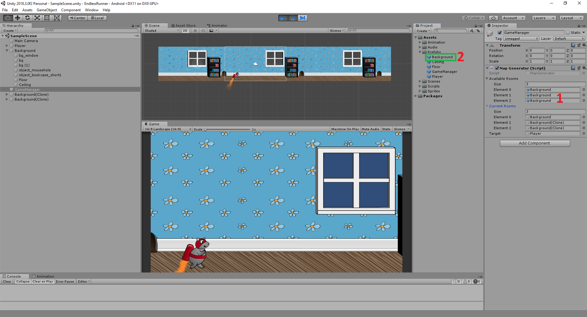

# Endless Runner Games for Unity

## Overview

The project whose goal is to learning how to automatically generate endless map.

## Features:

* Prefabs everywhere.
* Map generator will be done automatically, basing on room prefab list configurated from GameManager.

* Changing. To do this:
1. Modify **Available Rooms**
2. Folling **Background** prefab to create more. The most thing you need to look is 'Floor' - the hard code name used to get the width size for auto generate correct map.

## Upgrading

* To add obstacles/ coins/ ...
* To add parallax background.

## Android Setup

* Unity : 2018.3
* SDK : android-sdk-windows 
* JDK : jdk1.8.0_101

## Run the Project

To build and run on Android, click
**File > Build Settings**, select the **Android** platform, then
**Switch to Platform**, then **Build and Run**.

Or install the apk inside Bin\Android\

## Special Thanks

This section lists people who have contributed to this project by writing code, improving documentation or fixing bugs.

* [Reference](https://www.raywenderlich.com/5458-how-to-make-a-game-like-jetpack-joyride-in-unity-2d-part-1) for tutorial
